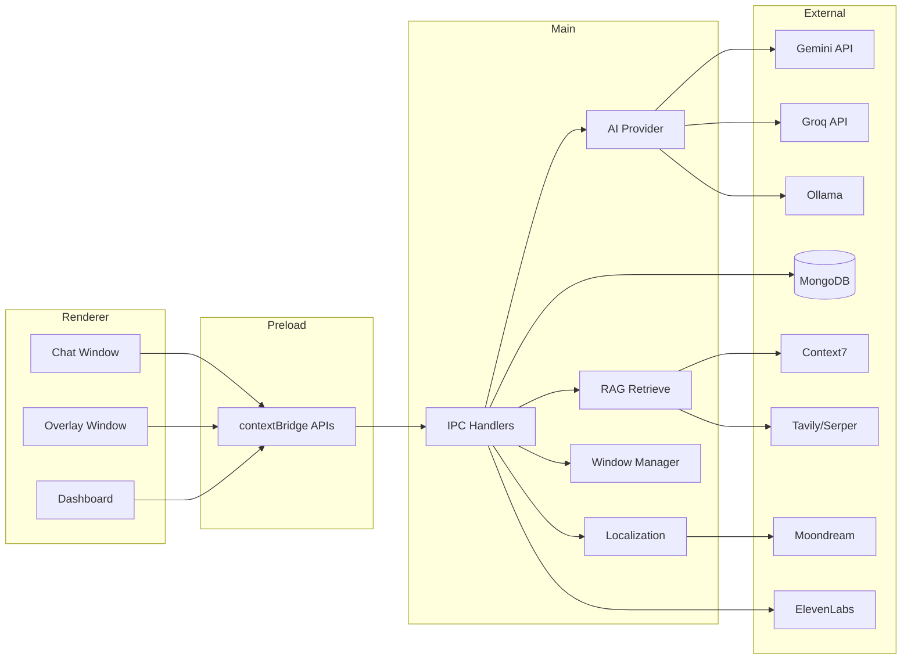

# Clarity (Jamhacks26) — Project Skills Map

Technical reference for the **Clarity** desktop overlay assistant: architecture, modules, data flow, and developer workflows.

---

## 1. Project Overview

| Field | Value |
|---|---|
| **Name** | Clarity (`package.json`: `clarity`) |
| **Purpose** | Screen-aware AI assistant overlay for navigation, tutoring, accessibility, and on-screen guidance |
| **Stack** | Electron 35, Node.js (CommonJS main), ESM renderer modules, React 19 (learning widgets), Vitest, Cloudflare Worker (optional Groq proxy) |
| **Entry point** | `main.js` → `src/main/app.js` |
| **Startup flow** | Load `.env` → log LLM/Moondream status → register IPC → create overlay/chat/minichat/dashboard windows → system tray → global shortcut `Ctrl+Alt+C` |

### What it does

- **Navigation mode**: Gemini/Ollama plans multi-step UI guidance; overlay shows cursor, highlights, Next/Complete prompts.
- **Tutor mode**: Gemini plans learning widgets; Groq implements interactive widgets; classic markdown+Mermaid fallback on failure.
- **RAG**: Local vector search (LanceDB/JSON) + remote Context7/web search for docs and library help.
- **Localization**: OCR + Moondream vision to find UI targets on cropped screenshots.
- **Accessibility**: Large text, magnifier, high contrast, screen reader, voice control, Alt+select TTS (ElevenLabs).
- **Persistence**: MongoDB Atlas for chat history; JSONL telemetry in `data/telemetry/`.

---

## 2. Directory Structure

```
Jamhacks26/
├── main.js                    # Electron entry (requires src/main/app.js)
├── package.json
├── wrangler.jsonc             # Cloudflare Worker config (Waymond proxy)
├── vitest.config.js
├── tailwind.widget.config.js
├── postcss.config.js
├── .env.example
├── skills.md                  # This file
│
├── scripts/
│   ├── build-widget-tailwind.mjs
│   └── migrate-rag-to-lance.js
│
├── docs/                      # RAG knowledge base (markdown)
│   ├── study/
│   ├── figma/
│   ├── vscode/
│   ├── google-docs/
│   └── internal-wiki/
│
├── data/                      # Runtime/generated (mostly gitignored)
│   ├── telemetry/
│   ├── lancedb/               # Vector store
│   └── transformers-cache/    # Local embedder model cache
│
├── src/
│   ├── index.ts               # Cloudflare Worker (Groq Whisper proxy)
│   ├── main/                  # Electron main process
│   ├── preload/               # contextBridge IPC surface
│   ├── renderer/              # UI windows (overlay, chat, dashboard)
│   └── shared/                # Cross-process utilities
│
├── test/                      # Vitest unit tests
│   ├── main/
│   ├── renderer/
│   └── shared/
│
└── .cursor/skills/            # Agent skills (e.g. gemini-screen-response)
```

**Ignored in tree above:** `node_modules/`, `dist/`, `.git/`, `.wrangler/`, `src/renderer/vendor/mermaid/` (vendored bundle).

---

## 3. Folder-Level Explanation

| Folder | Responsibility | Connects to |
|---|---|---|
| `src/main/` | Electron main: windows, IPC handlers, AI/RAG/capture/localization services | Preload ↔ Renderer via IPC; external APIs (Gemini, Groq, MongoDB, etc.) |
| `src/preload/` | Sandboxed bridge exposing `window.*` APIs | Renderer modules call these; IPC routes to `src/main/ipc/` |
| `src/renderer/` | Four BrowserWindows: overlay, chat, minichat, dashboard | Consumes preload APIs; captures screen/audio; renders tutor UI |
| `src/shared/` | Pure utilities shared by main + renderer | Localization coords, Mermaid normalization |
| `docs/` | Source documents for RAG ingestion | Indexed into LanceDB via `scripts/migrate-rag-to-lance.js` |
| `data/` | Vector index, model cache, telemetry logs | Written by main process at runtime |
| `scripts/` | Build/migration tooling | Postinstall Tailwind build; RAG migration |
| `test/` | Vitest tests mirroring `src/` layout | CI/local `npm test` |
| `src/index.ts` | Cloudflare Worker | Optional remote Whisper transcription for renderer |

---

## 4. Architecture

### System design

Electron app with **multi-window renderer** and **IPC-centric main process**. AI logic runs in main (API keys stay off renderer). Overlay is transparent, click-through capable, and spans displays.



### Data flow — chat send

1. User message in `chat.js` → `window.geminiChat.send(payload)` (preload).
2. `ipc/chat.js` builds RAG recipe: heuristics or `planRetrieval` → `rag/retrieve.js`.
3. Provider (`ai/provider.js`) calls Gemini or Ollama with screenshot + RAG context.
4. Response parsed as navigation steps or tutor widget plan.
5. Steps executed via `window.aiTools` (cursor, highlighter, localization IPC).
6. Telemetry logged to `data/telemetry/`; history saved via MongoDB IPC.

### Data flow — tutor widget

```
Gemini plan (classic | interactive designPlan)
  → classic: show learning widget directly
  → interactive: Groq implementInteractiveWidget()
  → on failure: buildClassicFallbackFromPlan()
```

Requires Gemini for planning (`USE_GEMINI_MODEL=true`). Groq optional but enables interactive widgets.

### Data flow — on-screen localization

```
Step with target label/bbox
  → crop screenshot (renderer context-crop.js)
  → OCR fast path (Windows PowerShell) OR Moondream point/detect
  → resolve-mark.js maps to CSS pixels
  → window.js sendOverlayPointAction → cursor/highlighter
```

### Core subsystems

| Subsystem | Location | Role |
|---|---|---|
| Window management | `src/main/window.js` | Overlay per display, chat/minichat/dashboard lifecycle |
| IPC layer | `src/main/ipc/*.js` | 11 domain registrars aggregated in `ipc/index.js` |
| AI routing | `src/main/ai/provider.js` | Gemini vs Ollama; tutor pipeline delegation |
| RAG | `src/main/rag/` | Ingest, embed, store, retrieve, remote providers |
| Capture | `src/main/capture/`, `src/renderer/capture/` | Screen frames + audio ring buffer |
| Localization | `src/main/localization/`, `ui-automation/` | OCR, Moondream, UIA mark discovery |
| Telemetry | `src/main/telemetry/` | Performance events + detailed activity log |
| Learning widgets | `src/renderer/modules/learning-widget.js`, `widget-runtime.js` | Markdown, Mermaid, sandboxed HTML widgets |

### External integrations

| Service | Env vars | Used for |
|---|---|---|
| Google Gemini | `GEMINI_API_KEY`, `GEMINI_MODEL` | Primary chat, planning, RAG router, widget planning |
| Groq | `GROQ_API_KEY`, `GROQ_MODEL` | Interactive widget implementation; optional Whisper proxy |
| Ollama | `OLLAMA_*`, `USE_GEMINI_MODEL=false` | Local text-only chat fallback |
| Context7 | `CONTEXT7_API_KEY` | Library/framework doc retrieval |
| Tavily / Serper | `TAVILY_API_KEY`, `SERPER_API_KEY` | Web search RAG |
| Moondream | `MOONDREAM_*` | Vision pointing/detection on UI crops |
| ElevenLabs | `ELEVENLABS_*` | TTS for explanations and Alt+select |
| MongoDB Atlas | `MONGODB_URI` | Chat history persistence |
| Cloudflare Worker | `CLARITY_PROXY_URL` / `WAYMOND_PROXY_URL` | Remote Groq Whisper transcription |

### Build / runtime flow

```
npm install
  └─ postinstall: scripts/build-widget-tailwind.mjs (widget CSS bundle)

npm run dev | npm start
  └─ electron . → main.js → app.js → windows + tray

npm run build[:win|:mac|:linux]
  └─ electron-builder → dist/

npm run worker:dev | worker:deploy
  └─ wrangler → src/index.ts (Groq transcription proxy)

npm test
  └─ vitest run (test/**/*.test.js)
```

---

## 5. File-Level Documentation

### Root & config

| Path | Responsibility | Key exports / functions | Deps |
|---|---|---|---|
| `main.js` | Electron bootstrap | — | `src/main/app.js` |
| `package.json` | Scripts, deps, electron-builder config | npm scripts | electron, @lancedb, ai SDK, react, mermaid, etc. |
| `wrangler.jsonc` | CF Worker name/entry | — | `src/index.ts` |
| `vitest.config.js` | Test runner config | `defineConfig` | vitest, happy-dom for renderer tests |
| `tailwind.widget.config.js` | Tailwind for AI widget blueprints | safelist from HTML | tailwindcss |
| `postcss.config.js` | PostCSS for widget CSS build | autoprefixer + tailwind | postcss |
| `.env.example` | Documented env template | — | — |

### `src/index.ts` — Cloudflare Worker

| Responsibility | Key functions | Deps |
|---|---|---|
| Waymond proxy: Groq Whisper transcription | `handleTranscribe`, `encodeWav`, `fetch` handler | Groq API, CORS via `ALLOWED_ORIGIN` |

Routes: `POST /transcribe`, `GET /health`.

### `src/main/` — Electron main process

#### Core

| Path | Responsibility | Key exports | Deps |
|---|---|---|---|
| `app.js` | App lifecycle, tray, shortcuts, env load | — | window, ipc, mongodb, ai/provider, capture/session |
| `window.js` | BrowserWindow creation/management, overlay actions | `createWindows`, `toggleChatWindow`, `sendOverlayPointAction`, `DASHBOARD_ENABLED` | electron, utils/*, annotations/store |

#### `src/main/ai/`

| Path | Responsibility | Key exports | Deps |
|---|---|---|---|
| `provider.js` | Route chat/step/retrieval to Gemini or Ollama | `chat`, `chatStep`, `planRetrieval`, `generateTutorWidget`, `getActiveProvider` | gemini, ollama, tutor |
| `tutor.js` | Tutor widget pipeline (plan → implement → fallback) | `generateLearningWidget` | gemini, groq, learning-widget-schema |
| `learning-widget-schema.js` | Zod schemas for widget JSON | parsers, validators | zod |
| `implement-widget.js` | Groq/Ollama implementation prompts | `buildImplementationPrompt`, schema helpers | learning-widget-schema |
| `adapt-widget.js` | Legacy explanation → classic widget | `buildClassicWidgetFromExplanation` | learning-widget-schema |
| `parse-model-json.js` | Extract JSON from LLM text | `parseModelJson`, `extractJsonBlock` | — |

#### `src/main/gemini/`, `groq/`, `ollama/`, `whisper/`, `elevenlabs/`

| Path | Responsibility | Key exports | Deps |
|---|---|---|---|
| `gemini/service.js` | Primary Gemini client + schemas/prompts | `chat`, `chatStep`, `planRetrieval`, `generateLearningWidget` | parse-model-json, shared/localization-coords |
| `groq/service.js` | Groq structured chat + widget implementation | `implementInteractiveWidget`, `generateStructuredChat` | implement-widget, parse-model-json |
| `groq/proxy.js` | Remote Whisper via CF Worker | `transcribeViaProxy` | fetch → CLARITY_PROXY_URL |
| `ollama/service.js` | Local Ollama mirror of Gemini surface | `chat`, `chatStep`, `planRetrieval`, `verifyModelReady` | gemini prompts, implement-widget |
| `whisper/service.js` | Local Whisper STT | `transcribe` | @xenova/transformers |
| `elevenlabs/service.js` | TTS API | `createSpeech` | fetch |

#### `src/main/ipc/`

| Path | Channels / exports | Backend imports |
|---|---|---|
| `index.js` | `registerIpcHandlers` | all ipc/* registrars |
| `chat.js` | `chat:send`, `chat:step`, RAG status events | ai/provider, rag/*, telemetry, window |
| `chat-history.js` | `chat-history:*` | mongodb/chat-history |
| `ai-tools.js` | cursor, highlighter, annotations, learning widget | window, annotations/store |
| `capture.js` | screen sources, audio buffer | capture/* |
| `dashboard.js` | overlay visibility, accessibility, quit | window |
| `elevenlabs.js` | `elevenlabs:speak` | elevenlabs/service |
| `whisper.js` | `whisper:transcribe` | whisper/service, groq/proxy |
| `window.js` | chat window chrome, tasks drawer | window |
| `rag.js` | `rag:status`, `rag:search` | rag/retrieve, rag/store |
| `localization.js` | SOM, OCR, Moondream IPC | ui-automation, localization/* |
| `telemetry.js` | telemetry query/record IPC | telemetry/* |

#### `src/main/rag/`

| Path | Responsibility | Key exports | Deps |
|---|---|---|---|
| `store.js` | Facade: Lance vs JSON store | `search`, `upsert`, `status` | store-lance, store-json |
| `store-lance.js` | LanceDB vector store | CRUD + vector search | @lancedb/lancedb |
| `store-json.js` | JSON file vector store | cosine search | fs |
| `embedder.js` | Facade: local vs Gemini embedder | `embed`, `embedBatch` | embedder-local, embedder-gemini |
| `embedder-local.js` | Xenova MiniLM embeddings | batch embed | @xenova/transformers |
| `embedder-gemini.js` | Gemini text-embedding-004 | batch embed | fetch |
| `ingest.js` | Chunk docs → embed → upsert | `ingestFile`, `ingestDirectory` | embedder, store |
| `retrieve.js` | Remote then local retrieval | `retrieve`, `retrieveLocal` | providers, embedder, store |
| `collections.js` | Map targetApp → collection name | `resolveCollection`, `resolveTutorCollection` | — |
| `heuristics.js` | Regex intent routing (skip LLM planner) | `routeIntentHeuristic` | — |
| `startup-index.js` | Manifest-based docs reindex | `scheduleStartupIndex` | ingest (not wired in app.js) |
| `providers/index.js` | Remote retrieval orchestrator | `fetchRemoteChunks` | context7, web-search |
| `providers/context7.js` | Context7 SDK fetch | `fetchContext7Chunks` | @upstash/context7-sdk |
| `providers/web-search.js` | Tavily/Serper search | `fetchWebChunks` | fetch |

#### Other main modules

| Path | Responsibility | Key exports | Deps |
|---|---|---|---|
| `capture/session.js` | Electron media permissions | `configureCaptureSession` | electron session |
| `capture/screen-capture.js` | desktopCapturer wrapper | `listSources`, `getSourceForDisplay` | electron |
| `capture/audio-buffer-store.js` | Ring buffer for audio chunks | push/drain/stats/clear | — |
| `localization/moondream-service.js` | Moondream vision API | `pointTarget`, `detectTarget` | fetch |
| `localization/moondream-point-refine.js` | Point refinement wrapper | `refinePoint` | moondream-service |
| `localization/moondream-detect-refine.js` | Bbox detection wrapper | `refineDetect` | moondream-service |
| `localization/ocr-boxes.js` | Windows OCR in crops | `findTextInCrop` | powershell/run-json |
| `localization/resolve-mark.js` | Bbox → CSS pixels | `resolveBboxToCss` | shared/localization-coords |
| `ui-automation/mark-discovery.js` | UIA mark discovery + grid fallback | `discoverMarks` | powershell/run-json |
| `mongodb/chat-history.js` | MongoDB chat persistence | save/list/clear/status/close | mongodb |
| `annotations/store.js` | In-memory tutor annotations | set/get/clear | — |
| `telemetry/chat-telemetry.js` | Performance JSONL log | record, summary, recent | fs → chat-events.jsonl |
| `telemetry/chat-activity-log.js` | Session activity JSONL + renderer push | record, recent | fs, window |
| `tools/ai-tools.js` | Main-side overlay event helpers | cursor/highlighter senders | window |
| `tools/capture.js` | Internal capture bundle | — | capture/* |
| `powershell/run-json.js` | Run PS script, parse JSON | `runPowerShellJson` | child_process |
| `utils/display.js` | Multi-display work area union | `getWorkAreaBounds` | electron screen |
| `utils/taskbar.js` | Restore Windows taskbar | `restoreWindowsTaskbar` | powershell |
| `utils/win32-chrome.js` | Win32 window helpers | `sendCtrlC`, title bar hide | ffi-like win32 calls |

### `src/preload/`

| Path | Responsibility | Exposes on `window` |
|---|---|---|
| `index.js` | contextBridge IPC facade | `capture`, `whisper`, `geminiChat`, `chatTelemetry`, `localization`, `chatHistory`, `ragKb`, `chatWindow`, `minichat`, `dashboard`, `aiTools` |

### `src/renderer/` — UI

#### Entry points

| Path | Loads | Initializes |
|---|---|---|
| `index.js` | overlay/index.html | accessibility, cursor, highlighter, learning-widget |
| `chat-index.js` | pages/chat.html | chat-accessibility, capture-service, chat, alt-tts |
| `minichat-index.js` | pages/minichat.html | restore chat button |

#### Pages

| Path | Role |
|---|---|
| `overlay/index.html` | Full-screen transparent overlay |
| `pages/chat.html` | Main AI chat UI |
| `pages/minichat.html` | Floating restore button |
| `pages/dashboard.html` | Control panel (inline script; overlay/chat toggles, streaks) |

#### Modules (`src/renderer/modules/`)

| Path | Responsibility | Key functions | Deps |
|---|---|---|---|
| `chat.js` | **Production chat** (~2k lines): send/step, voice, RAG, history, tutor/nav modes | `initChat` | preload APIs, activity-log |
| `chat/index.js` | Modular chat refactor (incomplete) | `initChat` | chat/* submodules (missing constants/state) |
| `chat/activity-log.js` | Dev activity log panel | session tracking, phase logging | chatTelemetry |
| `chat/ai-command.js` | Slash commands, step execution | localization + aiTools orchestration | refactor path only |
| `chat/attachments.js` | File/screen attachments | preview chips | refactor path |
| `chat/history.js` | Conversation persistence | bootstrap/save/clear | refactor path |
| `chat/prompt-loop.js` | Next/Complete wait loop | prompt handlers | refactor path |
| `chat/render.js` | Message DOM rendering | typing indicator, RAG listener | refactor path |
| `chat/voice.js` | Mic + Whisper + TTS | record/transcribe/speak | refactor path |
| `chat/window-chrome.js` | Chat window resize/hide | chatWindow IPC | refactor path |
| `accessibility.js` | Overlay a11y layer | magnifier, contrast, SR, voice control | aiTools |
| `chat-accessibility.js` | Chat window a11y prefs | DOM class toggles | dashboard prefs |
| `alt-tts.js` | Alt+select → ElevenLabs TTS | selection listener | aiTools.speakAccessibility |
| `capture-service.js` | Screen/audio capture singleton | `initCaptureServices` | renderer/capture/* |
| `context-crop.js` | Crop screenshots for localization | bbox crop to base64 | — |
| `cursor.js` | Virtual AI cursor + step widget | move, Next/Complete UI | aiTools events |
| `highlighter.js` | Canvas highlights (rect/circle/stroke) | draw/clear | aiTools events |
| `learning-widget.js` | Tutor panel (markdown, Mermaid, widgets) | show/hide, render | markdown, widget-runtime |
| `markdown.js` | Marked + DOMPurify + Mermaid fences | `renderMarkdown`, diagram enhance | marked, dompurify, mermaid |
| `mermaid-normalize.js` | Browser wrapper for shared normalize | re-exports | shared/mermaid-normalize |
| `widget-runtime.js` | Sandboxed shadow-DOM widget runtime | state bindings, Tailwind inject | widget-blueprint CSS |
| `som-annotate.js` | Set-of-Marks label drawing | (unused currently) | — |
| `dashboard/index.js` | Dashboard logic duplicate | (unused; HTML has inline script) | — |

#### Renderer capture

| Path | Responsibility | Key exports | Deps |
|---|---|---|---|
| `capture/screen-capture.js` | Desktop frame capture | getFrameBase64 | window.capture |
| `capture/audio-capture.js` | Mic + worklet streaming | start/stop | audio-ring-buffer, worklet |
| `capture/audio-ring-buffer.js` | PCM chunk buffer | push/drain | — |
| `capture/pcm-capture-processor.worklet.js` | AudioWorklet processor | process() | — |

#### Styles

| Path | Purpose |
|---|---|
| `styles/base.css` | Global tokens, scrollbars |
| `styles/chat.css` | Chat window UI |
| `styles/minichat.css` | Minichat button |
| `styles/cursor.css` | Virtual cursor + step widget |
| `styles/highlighter.css` | Highlight canvas |
| `styles/learning-widget.css` | Tutor panel |
| `styles/widget-blueprint-tailwind.css` | Tailwind source for widgets |
| `styles/widget-blueprint-tailwind.build.css` | Built widget CSS (postinstall) |
| `styles/widget-tailwind-safelist.html` | Tailwind content safelist |

#### Vendor (selected)

| Path | Purpose |
|---|---|
| `vendor/learning-widget-react.mjs` | React bundle for interactive widgets |
| `vendor/mermaid/*` | Vendored Mermaid diagram renderer |
| `vendor/purify.es.mjs` | DOMPurify ESM |
| `vendor/widget-blueprint-tailwind.css.js` | CSS string export for widget runtime |

### `src/shared/`

| Path | Responsibility | Key exports | Deps |
|---|---|---|---|
| `localization-coords.js` | Bbox/percent → CSS mapping (CJS) | `parseBbox`, `mapPointToCss`, etc. | — |
| `localization-coords.mjs` | ESM re-export | same | localization-coords.js |
| `localization-types.js` | Mark source constants | `MARK_SOURCES`, `MAX_MARKS` | — |
| `mermaid-normalize.js` | Diagram code normalization (CJS) | `normalizeDiagramCode`, fence regex | — |
| `mermaid-normalize.mjs` | ESM variant | same | — |

### `scripts/`

| Path | Responsibility | Usage |
|---|---|---|
| `build-widget-tailwind.mjs` | Build widget Tailwind CSS + JS export | `npm run build:widget-css`, postinstall |
| `migrate-rag-to-lance.js` | Migrate JSON index → LanceDB; `--re-embed` | manual CLI |

### `docs/` — RAG corpora

| Path | Content |
|---|---|
| `study/biology.md` | Sample study material |
| `figma/components.md` | Figma component help |
| `vscode/shortcuts.md` | VS Code shortcuts |
| `google-docs/*.md` | Google Docs formatting/tables/shortcuts |
| `internal-wiki/getting-started.md` | Internal wiki onboarding |

### `test/` — Vitest suites

| Area | Files | Covers |
|---|---|---|
| `test/main/ai/` | tutor-pipeline, implement-widget, adapt-widget, learning-widget-schema | Tutor pipeline, schemas |
| `test/main/gemini/` | normalize-plan, widget-contents | Gemini response normalization |
| `test/main/groq/` | service | Groq client |
| `test/main/ollama/` | parse-json | Ollama JSON parsing |
| `test/main/rag/` | heuristics | Intent routing |
| `test/main/localization/` | resolve-bbox, moondream-point | Coordinate + Moondream |
| `test/main/capture/` | screen-capture, audio-buffer-store | Capture serialization |
| `test/main/telemetry/` | chat-telemetry, chat-activity-log | Telemetry writers |
| `test/renderer/` | chat-load, markdown, widget-runtime, learning-widget, etc. | Renderer modules (happy-dom) |
| `test/shared/` | mermaid-normalize | Shared utilities |

---

## 6. Developer Intelligence

### Coding conventions

- **Main process**: CommonJS (`require`/`module.exports`).
- **Renderer**: ES modules (`import`/`export`) loaded from HTML `<script type="module">`.
- **Shared code**: Dual CJS + `.mjs` re-exports where both processes need the same logic.
- **IPC pattern**: One registrar per domain; channels named `domain:action`.
- **AI responses**: Structured JSON via Zod schemas; `parse-model-json.js` for extraction.
- **Env loading**: Manual `.env` parse in `app.js` (only sets unset keys).
- **Platform-specific**: Win32 helpers for taskbar, OCR, UIA; `process.platform` checks in preload.

### Environment variables

Copy `.env.example` → `.env`. Key groups:

| Group | Variables | Purpose |
|---|---|---|
| LLM | `GEMINI_API_KEY`, `GEMINI_MODEL`, `USE_GEMINI_MODEL`, `OLLAMA_*`, `GROQ_*` | Chat + widget implementation |
| RAG | `RAG_*`, `CONTEXT7_API_KEY`, `TAVILY_API_KEY`, `SERPER_API_KEY` | Retrieval routing and stores |
| Vision | `MOONDREAM_*`, `SOM_ENABLED` | UI localization |
| Voice | `ELEVENLABS_*`, `CLARITY_PROXY_URL` | TTS + remote Whisper |
| Data | `MONGODB_URI`, `MONGODB_DB` | Chat history |
| Telemetry | `TELEMETRY_ENABLED`, `CHAT_ACTIVITY_LOG` | Logging toggles |

`${VAR}` references in `.env` values are expanded at runtime for MongoDB URI.

### Config files

| File | Controls |
|---|---|
| `package.json` | Electron entry, scripts, electron-builder targets, asarUnpack for LanceDB native |
| `wrangler.jsonc` | CF Worker name `waymond-proxy`, entry `src/index.ts` |
| `vitest.config.js` | Test glob, node vs happy-dom environments |
| `tailwind.widget.config.js` | Widget blueprint Tailwind (no preflight) |
| `postcss.config.js` | CSS pipeline for widget build |
| `data/rag-manifest.json` | Doc hash manifest for reindex detection (gitignored) |

### Common commands

```bash
# Development
npm install          # also runs build:widget-css
npm run dev          # electron .
npm start            # same as dev

# Tests
npm test             # vitest run
npm run test:watch   # vitest watch

# Build desktop app
npm run build        # all platforms via electron-builder
npm run build:win    # Windows NSIS
npm run build:dir    # unpacked dir

# Widget CSS (manual if needed)
npm run build:widget-css

# RAG migration
node scripts/migrate-rag-to-lance.js
node scripts/migrate-rag-to-lance.js --re-embed

# Cloudflare Worker (Groq Whisper proxy)
npm run worker:dev
npm run worker:deploy
npm run worker:secret   # set GROQ_API_KEY on CF
```

### Notable gaps / in-progress work

- **Chat refactor**: `src/renderer/modules/chat/index.js` + submodules exist but production uses monolithic `chat.js`; missing `constants.js` / `state.js`.
- **RAG startup index**: `rag/startup-index.js` implemented but not called from `app.js`; indexing is manual/script-driven.
- **Dashboard**: Logic inline in `dashboard.html`; `dashboard/index.js` is unused duplicate.
- **Groq role**: Implementation-only for interactive widgets, not primary chat fallback.
- **Tutor mode**: Requires Gemini for widget planning even when Ollama handles navigation chat.

### Agent skills in repo

| Path | Purpose |
|---|---|
| `.cursor/skills/gemini-screen-response/SKILL.md` | Structured JSON schema for Gemini screen-assistant responses, TTS, plan actions |

---

## 7. Quick Reference — Preload → IPC → Service

| `window.*` API | IPC channel | Backend |
|---|---|---|
| `geminiChat.send` | `chat:send` | ipc/chat → ai/provider |
| `geminiChat.step` | `chat:step` | ipc/chat → ai/provider |
| `aiTools.moveCursor` | `ai-tools:cursor-move` | ipc/ai-tools → window |
| `aiTools.showLearningWidget` | `ai-tools:learning-widget-show` | ipc/ai-tools → overlay |
| `localization.moondreamPoint` | `localization:moondream-point` | ipc/localization → moondream |
| `whisper.transcribe` | `whisper:transcribe` | ipc/whisper → whisper or groq/proxy |
| `chatHistory.save` | `chat-history:save` | ipc/chat-history → mongodb |
| `ragKb.search` | `rag:search` | ipc/rag → rag/retrieve |
| `capture.getScreenSource` | `capture:get-screen-source` | ipc/capture → screen-capture |

---

*Generated from codebase analysis. Update this file when adding major subsystems or changing IPC/startup flow.*
